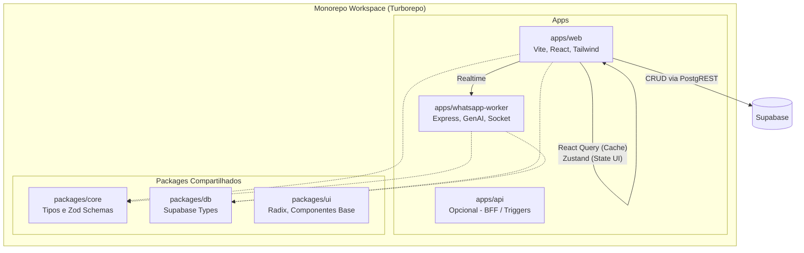

# 🏗️ Quark SaaS - Relatório de Auditoria de Arquitetura V5

## 1. Resumo Executivo
**Nota Geral de Arquitetura: 4.5 / 10**

O projeto Quark SaaS possui um potencial imenso e evoluiu rapidamente em termos de features, porém acumulou uma **dívida técnica significativa** devido ao rápido crescimento. A arquitetura atual sofre com a falta de um padrão rigoroso de state management, arquivos massivos ("God Components") e falta de organização em um monorepo real. Há um forte acoplamento entre UI, estado e requisições, o que impacta escalabilidade, performance de renderização e testabilidade.

---

## 2. Diagrama de Arquitetura Atual

```mermaid
graph TD
    subgraph "Frontend SPA (Vite + React)"
        UI[Componentes UI - Tailwind]
        Context[React Context API\nAuth, CRM, Financial]
        Store[Zustand/React Query\n(PoC)]
        UI <--> Context
        UI <--> Store
    end

    subgraph "Backend - Serviços Soltos"
        WABackend[whatsapp-backend\nExpress + Socket.io + Google AI]
        DepBackend[backend\nExpress + OpenAI WIP (Depreciado?)]
    end

    DB[(Supabase - PostgreSQL)]

    Context -- "Acesso Direto\n(PostgREST)" --> DB
    UI -- "Socket.io / HTTP" --> WABackend
    WABackend -- "Integração" --> DB
```

---

## 3. Análise Detalhada dos 4 Pontos

### 3.1 Fluxo Frontend ↔ Backend ↔ Supabase
- **Acesso Direto ao Banco:** O Frontend está assumindo o papel de Backend em grande parte do CRUD. Arquivos como `CrmContext.tsx` e `FinancialContext.tsx` fazem chamadas diretas ao Supabase (`supabase.from(...)`). Esse padrão exige que o Row Level Security (RLS) no Supabase esteja configurado com perfeição.
- **Backends Fragmentados:** Existem dois diretórios de backend: `whatsapp-backend` (que concentra toda a inteligência e bots, Socket.io, Google AI) e `backend` (que parece ser um rascunho com OpenAI e Evolution API, atualmente abandonado ou mal integrado).
- **Falta de BFF (Backend for Frontend):** A comunicação é fragmentada. A UI ora bate diretamente no banco de dados, ora se comunica via WebSockets com o `whatsapp-backend`.

### 3.2 TanStack Query e Zustand: PoC ou Realidade?
- **Integração apenas como PoC (Prova de Conceito).**
- O sistema possui `src/store/queryClient.ts` e `useUIStore.ts` (apenas 375 bytes de tamanho), evidenciando que o Zustand foi configurado para necessidades básicas de UI, mas não engoliu a complexidade do domínio.
- **A Dívida Técnica (Context Hell):** O real estado da aplicação está preso nos velhos `Contexts`. O `CrmContext.tsx` (10KB), `FinancialContext.tsx` (5KB) e `AuthContext.tsx` (7.6KB) continuam injetando lógica assíncrona densa diretamente na árvore do React, causando "re-renders" globais e gargalos de performance. Eles precisam ser substituídos pelo TanStack Query (para cache e state de servidor) e Zustand (state global estrito de cliente).

### 3.3 A Necessidade de um Monorepo Real (Turborepo)
- **Atualmente:** Não há workspace configurado no root `package.json`. São 3 projetos (`/`, `backend`, `whatsapp-backend`) isolados no mesmo repositório, repetindo dependências e scripts.
- **Compartilhamento Inexistente:** Não há compartilhamento dos tipos gerados pelo Supabase entre as pastas de backend e frontend. Se o banco muda, é preciso atualizar interfaces manualmente em múltiplos lugares.
- **Veredito:** **SIM.** Precisamos migrar para um **Turborepo** (ou pnpm workspaces). Isso permitirá:
  1. Pacote `packages/db` (centralizando types do Supabase e schemas do DB).
  2. Pacote `packages/ui` (compartilhamento de componentes se houver expansão).
  3. Apps segregados (`apps/web`, `apps/whatsapp-worker`).
  4. Build distribuído e paralelo em CI/CD.

### 3.4 God Components
Os componentes a seguir são um grande risco para manutenibilidade. Misturam UI, Tailwind extenso, chamadas ao Supabase, Socket.io (no caso do Conversations) e lógica de negócio.
- `Financial.tsx`: **60KB** (>900 linhas)
- `Conversations.tsx`: **57KB** (Instancia conexão WebSocket *dentro* do componente, o que é um anti-pattern crítico)
- `Calculator.tsx`: **55KB**
- `Proposals.tsx`: **48KB**
- `CRM.tsx`: **41KB**

---

## 4. Proposta de Arquitetura V5 Final (Turborepo + Clean)



---

## 5. Matriz de Priorização de Refatoração

### 🔴 Crítica (Fazer Imediatamente)
1. **Refatorar o `Conversations.tsx`:** Extrair a instanciação do `Socket.io` para um hook global ou serviço dedicado (Zustand store de WebSockets) para evitar re-conexões desnecessárias.
2. **Setup do Turborepo:** Criar a estrutura formal de workspaces (`apps/web`, `apps/whatsapp-backend`) para estancar a desorganização de pacotes.

### 🟠 Alta (Próxima Sprint)
3. **Quebrar os God Components:** Separar `Financial.tsx` e `Calculator.tsx` nos padrões: Container (busca os dados) + Presentational (renderiza a UI).
4. **Substituir Contexts por React Query:** Migrar as chamadas assíncronas de `CrmContext` e `FinancialContext` para Custom Hooks (ex: `useLeads()`, `useTransactions()`) baseados em `@tanstack/react-query`, ganhando cache inteligente.

### 🟡 Média 
5. **Limpeza do Backend Antigo:** Apagar ou mesclar as funcionalidades do `/backend` (2KB) para o worker consolidado se ele estiver realmente inútil.
6. **Centralizar Supabase Types:** Gerar e exportar interfaces baseadas em introspecção do banco via Supabase CLI em um package local, garantindo Type-Safety End-to-End.

### 🟢 Baixa
7. Refinamento de Design System e Componentes Compartilhados (Extração de botões e inputs para fora das pages e em um pacote isolado).
